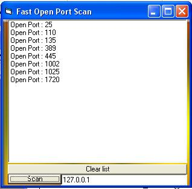



## A PowerFull Open Port Scanner

### Description

This is a super fast open port scanner (whit no timer !!) (am 12 year old)
 
### More Info
 

             |
---                |---
**Submitted On**   |2003-01-28 16:57:54
**By**             |[Duck Master](https://github.com/Planet-Source-Code/PSCIndex/blob/master/ByAuthor/duck-master.md)
**Level**          |Beginner
**User Rating**    |3.4 (34 globes from 10 users)
**Compatibility**  |VB 6\.0
**Category**       |[Coding Standards](https://github.com/Planet-Source-Code/PSCIndex/blob/master/ByCategory/coding-standards__1-43.md)
**World**          |[Visual Basic](https://github.com/Planet-Source-Code/PSCIndex/blob/master/ByWorld/visual-basic.md)
**Archive File**   |[A\_PowerFul1536241292003\.zip](https://github.com/Planet-Source-Code/duck-master-a-powerfull-open-port-scanner__1-42787/archive/master.zip)

